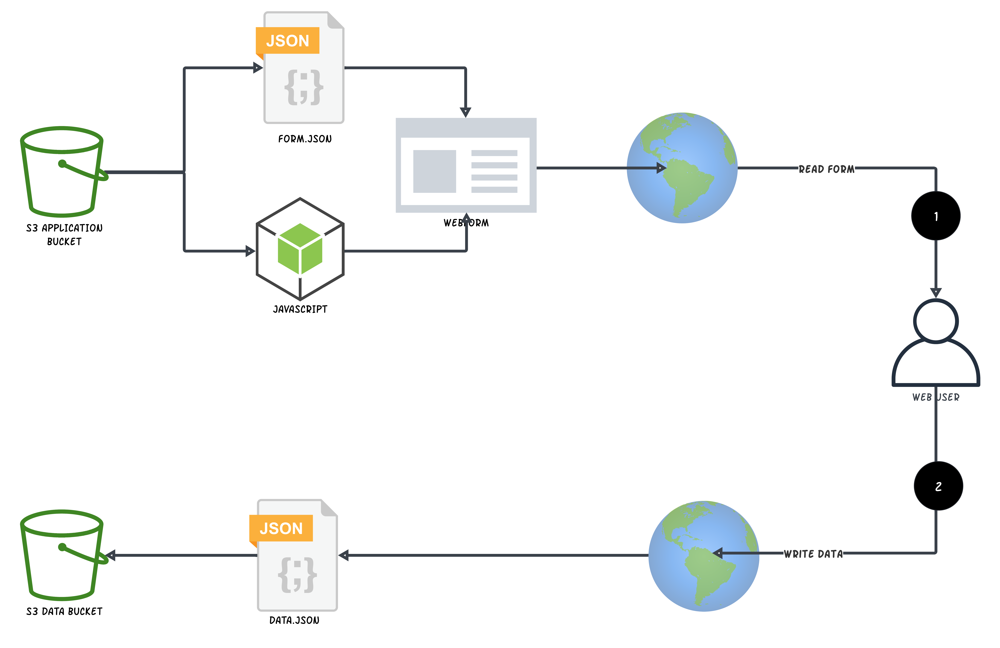

# JavaScript Application for Dynamic Web Form on S3

## Technical Requirements

1. We need a JavaScript/HTML application that renders a web form.
  
2. The application must be deployed as a static website in an AWS S3 bucket (no other technology)
  
3. The architecture of the system is 

4. The fields in the web form should be configurable based on form.json https://raw.githubusercontent.com/zeisys/nodejs-webform/main/form.json
  
5. The webform must have a CSS where various web elements must have styles associated with it
  
7. A user who loads the web form and enters data, on clicking submit 1711987429000.json must be written into a second AWS bucket (no other technology). The data file should be similar to https://raw.githubusercontent.com/zeisys/nodejs-webform/main/data.json . The number is the epoch time in milliseconds.

8. Only javascript maybe used. No frameworks such as react, angular, next etc are necessary. If you insist on using any of these technologies, make sure your application can be deployed on s3. No dynamic server is allowed.

9. All code must execute from the browser (no backend serverr)  9. For award, the URL of the s3 application must be published (no exceptions).
    
10. Delivery must ASAP
  
11. After award, the code must be handed over. and will be independently tested by us.
   
12. The developer who is awarded must sign a Non Disclosure Agreement (NDA) and Intellectual Property Agreement (IPA). This will require you to supply your full name and email address because these agreements must electronically signed using DocuSign. If you have concerns about this requirement, please check with Freelancer before contacting us. This is mandatory and the requirement cannot be waived.

13. Please do not contact us with alternate technologies, tools, and solutions. Please do not contact us with inquiries about budget, timeframe etc. All information is supplied here.
